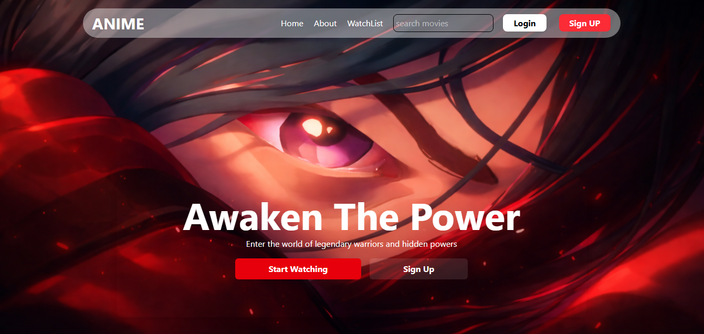

# 🎬 ANIME – MERN Movie Streaming Service

A full-stack movie streaming web application built using the MERN stack (**MongoDB, Express, React, Node.js**) that allows users to browse, watch, and manage animated movies seamlessly.

---

## 🚀 Features

* 🎟️ Watch animated movies online
* 🔐 Secure authentication using JWT
* ❤️ Add movies to watchlist
* 📺 Responsive and modern UI
* ⚡ Fast and dynamic content loading

---

## 🛠️ Tech Stack

**Frontend:** React, Tailwind CSS
**Backend:** Node.js, Express.js
**Database:** MongoDB
**Authentication:** JWT (JSON Web Token)

---

## 📸 Screenshots

### 🏠 Home Page



---

## ⚙️ Installation & Setup

### 1. Clone the repository
```bash
git clone https://github.com/shiva7784/Anime.git
cd Anime
```

### 2. Setup the Backend
Open a terminal window and run:
```bash
cd backend
npm install
npm start
```

### 3. Setup the Frontend
Open a **new** terminal window and run:
```bash
cd frontend
npm install
npm run dev
```

---

## 📌 Future Improvements

* 🎬 Add video player controls
* 💬 User reviews & ratings
* 🔎 Search & filter functionality
* 💳 Subscription/payment integration

---

## 🤝 Contributing

Pull requests are welcome. For major changes, please open an issue first.

---

## 📄 License

This project is licensed under the MIT License.
