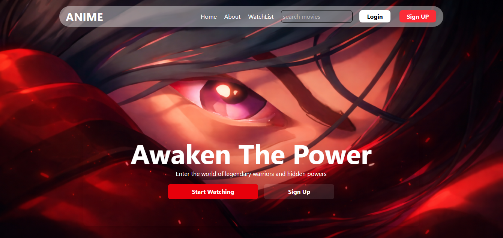

# 🎬 ANIME – Full-Stack Anime & Movie Streaming Platform

A modern, high-performance **MERN Stack** (MongoDB, Express.js, React, Node.js) streaming platform designed for browsing, searching, and watching Anime Movies and TV Series with an ultra-responsive dark-crimson aesthetic.

---

## 🌟 Key Features

- 📺 **Dedicated Anime TV Series Player**: Built-in TV player (`vidsrc.ru/tv/...`) with dynamic **Season** and **Episode** selection, Episode grid picker, and **Next/Prev Episode** controls.
- 🎬 **Dedicated Movie Player**: High-definition movie streaming (`vidsrc.ru/movie/...`) with responsive 16:9 aspect ratio player containers.
- 🎨 **Modern Dark Crimson Design System**: Fully responsive UI tailored for Mobile, Tablet, Laptop, and Desktop screens built with Tailwind CSS v4 and Swiper touch sliders.
- 🔔 **Interactive Toast Notifications**: Replaced native browser alerts with custom animated Toast notifications (`success`, `error`, `warning`, `info`).
- 🔐 **JWT Authentication & Security**: Secure user registration, password hashing with bcrypt, JWT token authentication, and HTTP-only cookies.
- ❤️ **Personal Watchlist**: Authenticated users can save, manage, and track their favorite movies and anime series in real-time.
- 🔍 **Live Multi-Search**: Instant search querying TMDB for both Anime Movies and TV Series with distinctive category badges.
- 🌐 **Production Vercel Ready**: Pre-configured serverless handlers, CORS, cookies, and Vercel routing configs for single-click deployment.

---

## 🛠️ Tech Stack

| Tier | Technologies |
| :--- | :--- |
| **Frontend** | React 19, Vite, Tailwind CSS v4, Swiper, React Router DOM v7, Axios |
| **Backend** | Node.js, Express.js, Mongoose, Cookie Parser, Cors, JsonWebToken |
| **Database** | MongoDB Atlas |
| **APIs & Players** | TMDB API (The Movie Database), VidSrc Video Stream Engine |
| **Deployment** | Vercel (Serverless Backend + Static SPA Frontend) |

---

## 📸 Screenshots

### 🏠 Home Page & Banner


*The platform features a modern hero banner with dynamic user welcome messages, glassmorphism cards, and responsive Swiper carousels.*

---

## 🚀 Deployment on Vercel

The application is structured for seamless deployment on [Vercel](https://vercel.com).

### Separate Vercel Projects (Recommended)

#### 1️⃣ Deploying Backend (`/backend`)
1. Import the repository in Vercel and set the Root Directory to `backend`.
2. Add the following **Environment Variables** in Vercel Project Settings:
   ```env
   MONGODB_URI=your_mongodb_connection_string
   jwt_SECRET=your_jwt_secret_key
   NODE_ENV=production
   FRONTEND_URL=https://your-frontend-app.vercel.app
   ```
3. Deploy! Vercel will automatically detect `backend/vercel.json` and deploy Express as a Serverless Function.

#### 2️⃣ Deploying Frontend (`/frontend`)
1. Import the repository in Vercel and set the Root Directory to `frontend`.
2. Add the following **Environment Variables**:
   ```env
   VITE_BACKEND_URL=https://your-backend-app.vercel.app
   VITE_TMDB_API_KEY=your_key_here
   ```
3. Deploy! Vercel will build Vite and route all SPA paths through `frontend/vercel.json`.

---

## ⚙️ Local Development Setup

### Prerequisites
- Node.js (v18+)
- MongoDB Atlas connection string
- TMDB API key

### 1. Clone the Repository
```bash
git clone https://github.com/shiva7784/Anime.git
cd frontend
```

### 2. Backend Setup
```bash
cd backend
npm install
```
Create a `.env` file in `/backend`:
```env
MONGODB_URI=your_mongodb_connection_string
jwt_SECRET=your_jwt_secret
NODE_ENV=development
PORT=5000
FRONTEND_URL=http://localhost:5173
```
Run backend locally:
```bash
npm run dev
```

### 3. Frontend Setup
```bash
cd ../frontend
npm install
```
Create a `.env` file in `/frontend`:
```env
VITE_BACKEND_URL=http://localhost:5000
VITE_TMDB_API_KEY=your_key_here
```
Run frontend locally:
```bash
npm run dev
```
Open `http://localhost:5173` in your browser.

---

## 📄 License

This project is licensed under the MIT License.
